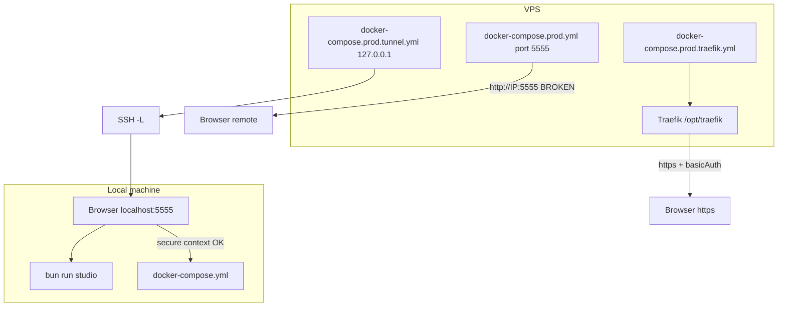

# Deployment overview

This project runs [Prisma Studio](https://www.prisma.io/studio) in Docker to browse and edit an external PostgreSQL database. The Docker image is published to GHCR on every push to `main`:

```
ghcr.io/linkphoenix/prisma-studio-docker:latest
```

## Architecture



## Decision matrix

| Scenario | Compose file | UI works? | Recommended | Documentation |
|----------|--------------|-----------|-------------|---------------|
| Local dev (Docker build) | [`docker-compose.yml`](../docker-compose.yml) | Yes | Dev | [local-development.md](./local-development.md) |
| Local dev (no Docker) | — `bun run studio` | Yes | Dev | [local-development.md](./local-development.md) |
| VPS HTTP public `:5555` | [`docker-compose.prod.yml`](../docker-compose.prod.yml) | **No — UI crash** | Never on public IP | [vps-direct-http-warning.md](./vps-direct-http-warning.md) |
| VPS Traefik + basic auth | [`docker-compose.prod.traefik.yml`](../docker-compose.prod.traefik.yml) | Yes | **Production** | [vps-traefik.md](./vps-traefik.md) |
| VPS SSH tunnel | [`docker-compose.prod.tunnel.yml`](../docker-compose.prod.tunnel.yml) | Yes (via localhost) | Admin / solo | [vps-ssh-tunnel.md](./vps-ssh-tunnel.md) |

## Common prerequisites

All deployment paths assume:

1. A PostgreSQL database and its connection URL (`DATABASE_URL`)
2. Introspected schema: `bun run db:pull` → commit `prisma/schema.prisma` → push (rebuilds GHCR image)
3. Docker (and optionally [Bun](https://bun.sh/) for local schema sync)

## Which compose file should I use?

### Local development

Use [`docker-compose.yml`](../docker-compose.yml) to build from source with live schema volumes, or skip Docker entirely with `bun run studio`. See [local-development.md](./local-development.md).

### Production on a VPS

| Your setup | Use |
|------------|-----|
| Traefik already running at `/opt/traefik` | [`docker-compose.prod.traefik.yml`](../docker-compose.prod.traefik.yml) + dynamic config |
| No reverse proxy, admin access only | [`docker-compose.prod.tunnel.yml`](../docker-compose.prod.tunnel.yml) + SSH tunnel |
| Testing GHCR image locally | [`docker-compose.prod.yml`](../docker-compose.prod.yml) on `localhost` only |

**Do not** expose [`docker-compose.prod.yml`](../docker-compose.prod.yml) on a public IP. The Studio UI will crash. See [vps-direct-http-warning.md](./vps-direct-http-warning.md).

## Security

Production deployments should use HTTPS and basic authentication. See [security.md](./security.md).

## Related docs

- [Local development](./local-development.md)
- [VPS direct HTTP warning](./vps-direct-http-warning.md)
- [VPS Traefik deployment](./vps-traefik.md)
- [VPS SSH tunnel](./vps-ssh-tunnel.md)
- [Security](./security.md)
